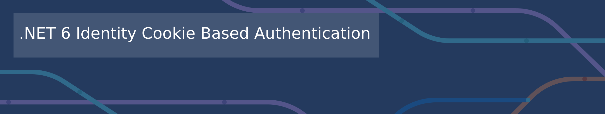

 

# [.NET 8 Identity Cookie based](https://github.com/madcoda9000/dotnet-cookie-based-identity)  -  Credits

## Many thanks to the follwing Projects / Librarys

- Parts of this Article [ASP.NET Core: From Beginner to advanced](https://burakneis.com/asp-net-core-identity/)
- [Identity Server 4](https://github.com/IdentityServer/IdentityServer4) for ASP.NET Core Identity management. I've used this version because the actual version is not free anymore! Duende decided to force a fee for commercial use of Identity Server 5.
  - License: [Apache License 2.0](https://github.com/IdentityServer/IdentityServer4/blob/main/LICENSE)
- [Datatables Js](https://datatables.net/) (the client library!).
  - License: [MIT](https://datatables.net/license/mit)
- [DoxyGen](Https://doxygen.nl) for generating the class documantation, which can be found [here](Documentation/generated/html/)
  - License: [GPL 2.0](https://github.com/doxygen/doxygen/blob/master/LICENSE)
- [Bootstrap 5.1](https://getbootstrap.com) for creating the layouts
  - License: [MIT](https://github.com/twbs/bootstrap/blob/v4.0.0/LICENSE)
- [Jquery](https://jquery.com) for making javascript easier :-)
  - License: [MIT](https://jquery.org/license/)
- [Toastify](https://apvarun.github.io/toastify-js/) for creating nice toast messages
  - License: [MIT](https://github.com/apvarun/toastify-js/blob/master/LICENSE)
- [Bootstrap Session Timeout](https://jquery-plugins.net/bootstrap-session-timeout) for detecting activity and do a session timeout
  - License: [MIT](https://github.com/orangehill/bootstrap-session-timeout/blob/master/LICENSE.md)
- [Novell.Directory.Ldap.NETStandard](https://github.com/dsbenghe/Novell.Directory.Ldap.NETStandard)
  - License: [MIT](https://github.com/dsbenghe/Novell.Directory.Ldap.NETStandard/blob/master/LICENSE)
- [Pomelo.EntityFrameworkCore.MySql](https://github.com/PomeloFoundation/Pomelo.EntityFrameworkCore.MySql)
  - License [MIT](https://github.com/PomeloFoundation/Pomelo.EntityFrameworkCore.MySql)
- [SeriLog](https://serilog.net/)
  - License [Apache 2.0](https://www.apache.org/licenses/LICENSE-2.0)

## NOTE

You've to respect the license of the projects I've listetd here! That's why i listed the projects here with the corosponding link.  
As i am writing this documentation they provide a free (for commercial too) License! **Anyway, they can change their license. So, before using this in an commercial project, do yourself a favour and visit their page to verify that they provide a free license that is suitable for commercial use!**