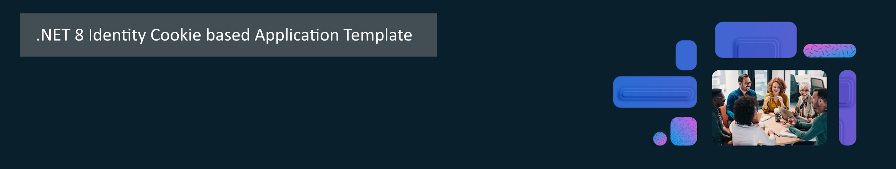

 

# Features of [.NET 8 Identity Cookie based](https://github.com/madcoda9000/dotnet-cookie-based-identity)

### Core Features
* using .NET Core 8 LTS
* using entity Framework
* supports MySql, MariaDb, SqLite and SqlServer
* Provides Authentication with Identity Framework and LDAP
  * Login
  * Register
  * Forgot Password
  * Change Password
  * optional email verification
  * 2fa by Authenticator App (Microsoft or Google)
  * 2fa by email
* Provides Authorization
  * Claim based
  * role based
* provides global error handling
  * for status errors
  * for exceptions
* is multilanguage
  * implemented english translation
  * implemented german translation
  * additional languages can easily implemented with addidtional ressource files
* provides a bootstrap based theme
  * only three layout files (Main, Auth, Error)
  * easy to customize
* Meets almost all requirements for:
  * Performance
  * Accessibility
  * Best Practices
  * SEO

  

### Application Admin Features
* provides application settings service
  * easy to extend settings service with own settings classes
* Settings available for
  * LDAP
  * Mailserver
  * Session
  * Branding
* provides session timeout due to inactivity
* provides loggin using serilog
  * audit logging
  * exception logging
  * application logging
* provides usermanagement
  * create, edit users
  * enforce 2fa
  * set ldap login
  * assign roles
  * enable / disable users
* provides role management
  * create / edit roles
* provides easy Brand customizing
  * set Application name
  * set primary color
  * set warning color
  * set info color
  * set success color
  * set danger color
  * set background color
  * set Application Logo
  * Restore Brand settings to default

### Application User Features

  * provides user selfservice
  * reset password
  * change password
  * edit profile
  * edit profile picture (stored in database)

