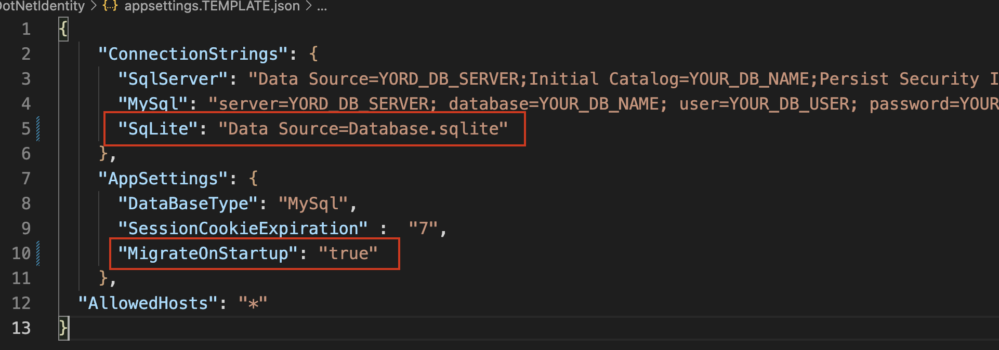

 

# Installation instructions for [.NET 8 Identity Cookie based](https://github.com/madcoda9000/dotnet-cookie-based-identity)

## Requirements

* install Microsoft .Net Core 8.0 SDK [(download here)](https://dotnet.microsoft.com/en-us/download/dotnet/6.0)
  * ensure .Net Framweork is installed by opening a Powershell or terminal window.
  * type: `dotnet --info`
  * If you get a list with installed SDK's, everything is fine.

   

* install Dotnet EntityFramework Core tools
  * open a powershell window (or a terminal on Linux or MacOs)
  * type: `dotnet tool install --global dotnet-ef`
  * verify successful installation by typing: `dotnet ef`

   
* if you want to use a Database like MySql or MS-SqlServer, ensure that they are up and accessible. This ist not neccessary as this application can use SqLite too. But for a production enviroment i strongly recommend to use a seperate database server.

## Installation

### Preparations

* download the latest [release](https://github.com/madcoda9000/dotnet-cookie-based-identity/releases)
* extract the zip to a location of your choice
* open a Powershell or Terminal (on Mac or Linux) and navigate into the extracted folder
* rename appsettings.TEMPLATE.json to appsettings.json
  * Mac / Linux Terminal: `mv appsettings.TEMPLATE.json appsettings.json`
  * Windows Powershell: `Rename-Item .\appsettings.TEMPLATE.json -NewName appsettings.json`
* modify the appropiate connection string (MySql, SqlServer or SqLite) in appsettings.json to match your enviroment
* modify the value of the Setting **DataBaseType** under **AppSettings** in appsettings.json to match your connectionstring
* set the value of the Setting **MigrateOnStartup** under **AppSettings** in appsettings.json to **true** (if not already)

  ###### Examples

  for Microsoft Sql Server
   

  for MariaDB or MySql
   

  for SqLite
   

  NOTE: make sure that you've no typo in the DatabaseType setting! Valid values are: MySql, SqLite and SqlServer. All other values will throw the following error.

   

### the magic.. (if everthing goes well!)

* type `dotnet run`
  * When you've no typo in your connectionstring and your Database server is reachable, the application will try to create the database and the tables. After that the application will start a browser and open the application.
    Your console window output should look like that:
     
    **HINT**: In your case the the https port typically would be 5001. So the url to your new app will be https://localhost:5001
* stop the application by pressing the following in the terminal (or Powershell) window where you've started the application
  * Mac: CMD + C
  * Linux & Windows: STRG + C

  The application will shutdown now.
* set the value of the Setting **MigrateOnStartup** under **AppSettings** in appsettings.json to **false**

   

  Otherwise the application will check and try to migrate the initial Database setup on every launch. That is not a problem in a development enviroment. But I would reccomend to disable this.
* now you can start the application by typing `dotnet run` or publish it using IIS, Apache2 or Nginx.
  * Your console window output should look like that:
     
* open your Browser and navigate to https://localhost:5001
* You can login using the following credentials:
  * **Username**: super.admin
  * **Password**: Test1000!

