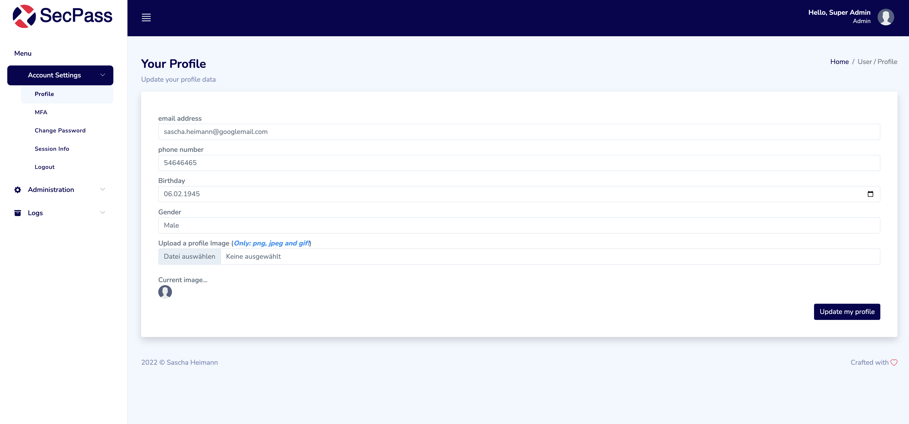
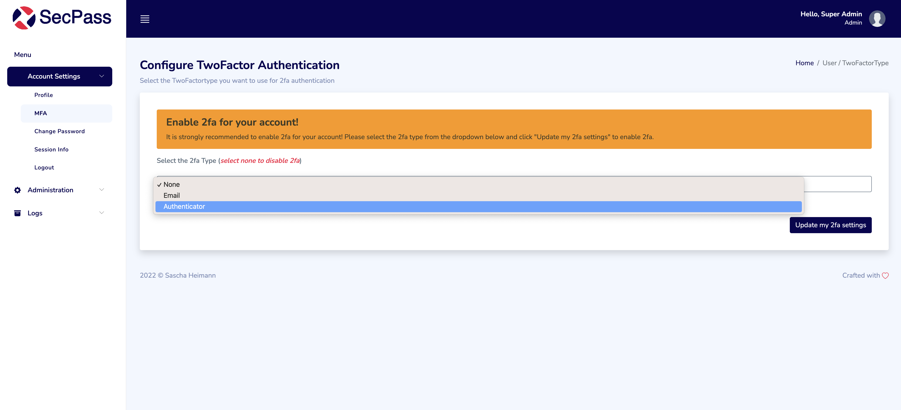
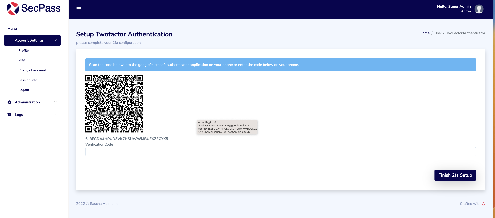
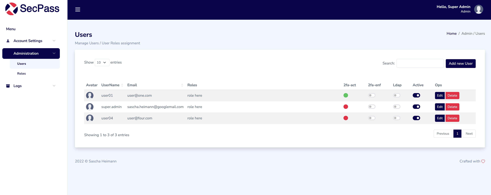
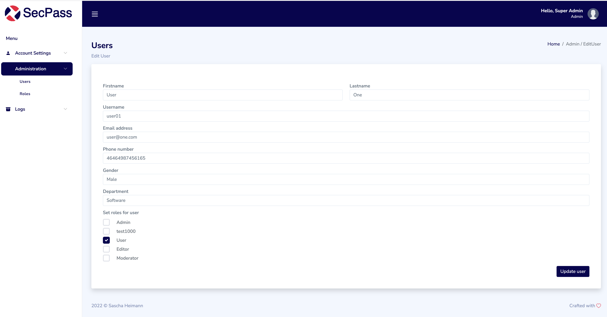
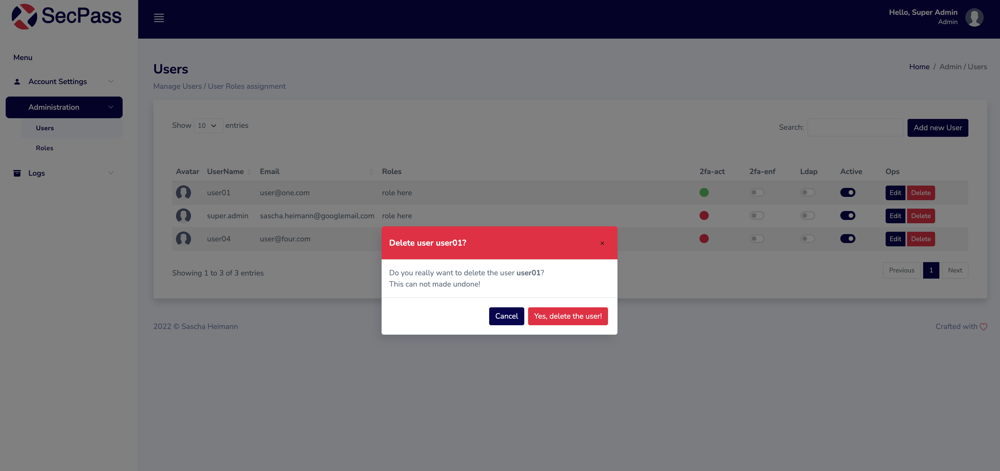
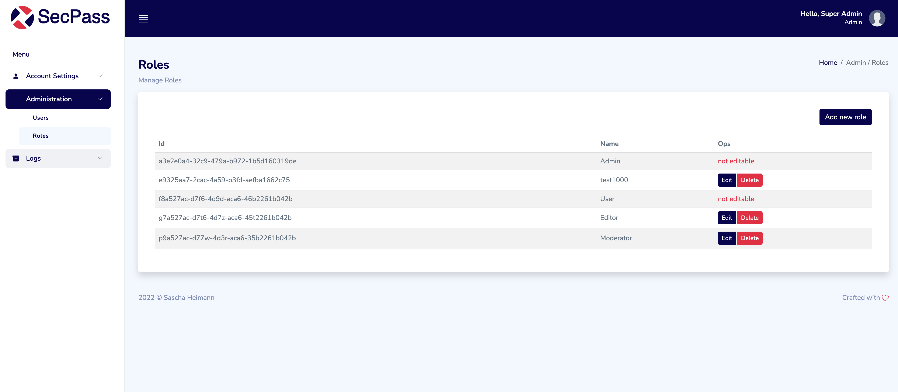
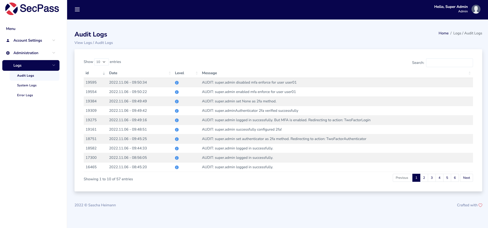
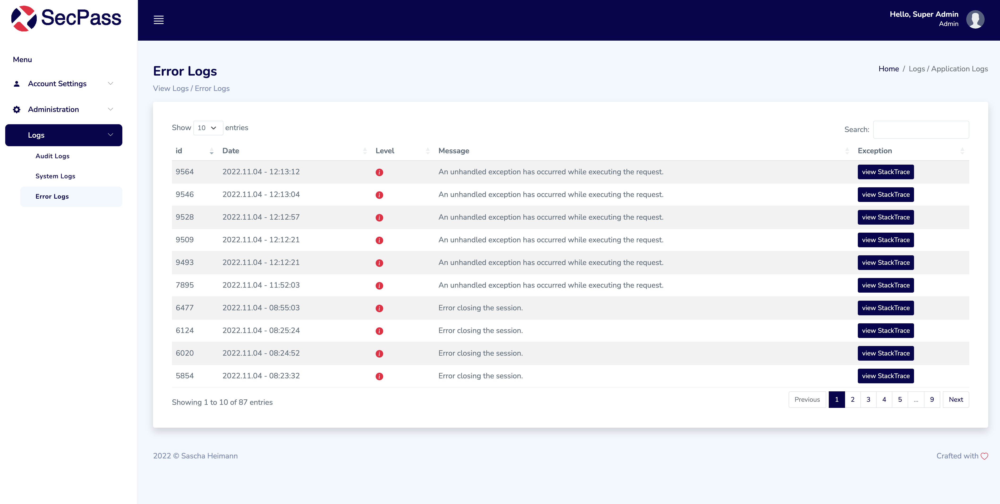

# Screenshots from [.NET 6 Identity Cookie based](https://github.com/madcoda9000/dotnet-cookie-based-identity)

## Login

## Main View

## Profile

## 2fa Settings

## 2fa Authenticator configuration

## 2fa Authenticator configuration Recovery codes

## 2fa Login

## change Password

## Users

## Users edit

## Users Delete

## Roles

## Audit Logs

## System Logs

## Error Logs

