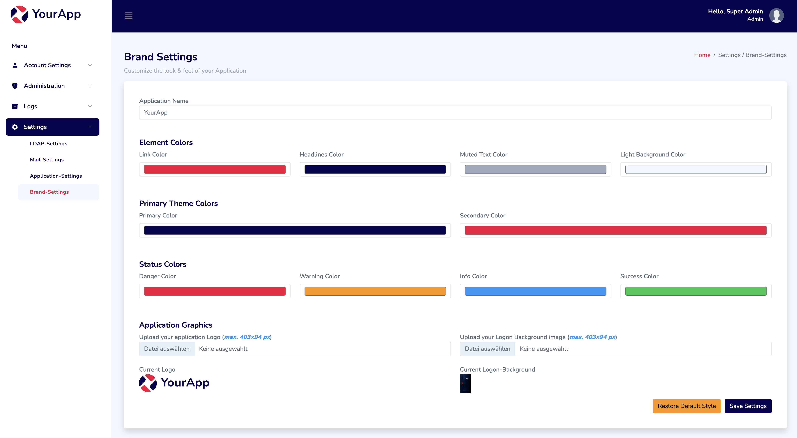

 

# [.NET 8 Identity Cookie based](https://github.com/madcoda9000/dotnet-cookie-based-identity) - Screenshots

## Login

## Welcome

## Profile

## 2fa Settings

## 2fa Authenticator configuration

## 2fa Authenticator configuration Recovery codes

## 2fa Login

## change Password

## Register

## Reset Password

## Users

## Roles

## Audit Logs

## System Logs

## Error Logs

## LDAP Settings

## Mail Settings

## App Settings

## Brand Settings

